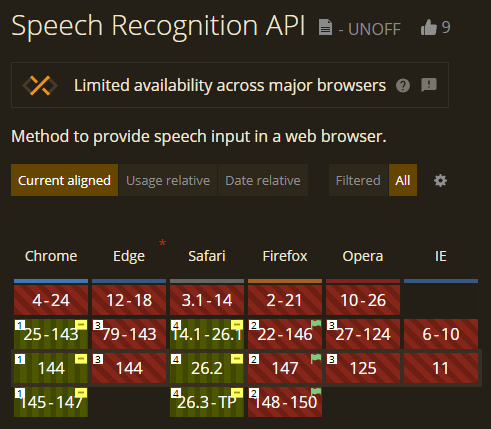

# Estudiante Elite 🛡️⚖️

**El tutor pedagógico de IA definitivo para estudiantes de Derecho.**

### [🚀 **VER DEMO DESPLEGADA AQUÍ**](https://estudiante-elite.netlify.app/)

---

### 🎓 Descripción

**Estudiante Elite** es una plataforma educativa premium diseñada específicamente para la comunidad jurídica. Combina algoritmos avanzados de IA con una interfaz de usuario sofisticada para ofrecer tutorías personalizadas, generación de esquemas complejos y gestión eficiente del historial de estudio.

El sistema no se limita a responder dudas, sino que actúa como un tutor proactivo que fomenta el estudio activo.

### ✨ Características Principales

- 💬 **Tutoría Inteligente via n8n**: Conexión en tiempo real con flujos de trabajo de n8n para proporcionar respuestas precisas y pedagógicas.

- 🎤 **Transcripción de Audio a Texto**: Sistema de reconocimiento de voz integrado para hacer preguntas hablando en lugar de escribir (disponible en Chrome y Safari).

- 📊 **Generador de Esquemas Jurídicos**: Herramienta integrada para transformar conceptos complejos en estructuras visuales claras.

- 🔐 **Seguridad y Persistencia**: Sistema de autenticación con Supabase y almacenamiento en tiempo real de conversaciones e historial.

- 🚀 **Optimización Extrema**: Sin dependencias pesadas de animación, utilizando CSS puro para un rendimiento impecable.

---

### 🎤 Sistema de Transcripción de Audio

La aplicación incluye un sistema de **reconocimiento de voz en tiempo real** que permite hacer preguntas hablando en lugar de escribir.

#### Cómo Usar

1. **Click en el botón de micrófono** (icono 🎤) junto al campo de entrada
2. **Habla tu pregunta** en español
3. **El texto aparece en tiempo real** mientras hablas
4. **Click nuevamente** para detener la grabación
5. **Revisa y edita** si es necesario antes de enviar

#### Compatibilidad de Navegadores

> **⚠️ IMPORTANTE**: La funcionalidad de transcripción de audio utiliza la **Web Speech API**, que tiene disponibilidad limitada entre navegadores.



**Navegadores Compatibles:**

- ✅ **Chrome** (Desktop y Android) - Soporte completo
- ✅ **Edge** (Chromium) - Soporte completo
- ✅ **Safari** (macOS e iOS) - Soporte completo

**Navegadores con Soporte Limitado o Sin Soporte:**

- ⚠️ **Brave** - Puede requerir desactivar Shields para el sitio
- ⚠️ **Opera** - Soporte parcial
- ❌ **Firefox** - Sin soporte
- ❌ **Internet Explorer** - Sin soporte

---

### 🤖 Arquitectura n8n y Lógica Pedagógica

El núcleo de la inteligencia de Estudiante Elite reside en flujos de trabajo automatizados que gestionan la lógica pedagógica:

#### 1. Tutor Pedagógico Principal

Este flujo gestiona la conversación interactiva, manteniendo el contexto del usuario (memoria de sesión) y aplicando técnicas de enseñanza adaptativas como el método Feynman o preguntas de autoevaluación.

#### 2. RAG con Manuales Oficiales

Implementación de **RAG (Generación Aumentada por Recuperación)** utilizando los **manuales oficiales de la carrera**. El sistema consulta la base de conocimientos oficial antes de generar respuestas para asegurar precisión jurídica y alineación con el temario.

---

### ⚙️ Configuración del Modelo y API (Compliance)

_Documentación técnica del entregable obligatorio._

Para garantizar la **velocidad de respuesta y baja latencia** requerida en las especificaciones técnicas de la prueba, el sistema utiliza el modelo **ChatGPT 5.2** orquestado a través de n8n.

A continuación se adjunta la evidencia de la configuración en los nodos de producción, asegurando el cumplimiento de la optimización del modelo:


_Fig 1. Configuración del nodo principal con modelo gpt-5.2_


_Fig 2. Validación del modelo en el flujo de chat OpenAI_

---

### 🛠️ Stack Tecnológico

- **Frontend**: Vite + React 19 + TypeScript
- **Estilos**: Vanilla CSS con arquitectura de variables personalizadas
- **Backend as a Service**: Supabase (Auth, PostgreSQL, RLS)
- **Capa de IA / Automatización**: n8n Webhooks & Workflows
- **Reconocimiento de Voz**: Web Speech API (nativa del navegador)
- **Iconografía**: Lucide React
- **Despliegue**: Netlify (CI/CD)

### 🎨 Sistema de Diseño

#### Paleta de Colores Exclusiva

- **Fondo**: `#121827` (Dark Slate Profundo)
- **Principal**: `#1E3A8A` (Azul Real Académico)
- **Acento**: `#00C2FF` (Cian Eléctrico)
- **Resalte**: `#E1C699` (Oro Suave/Cápsula de Tiempo)
- **Superficies**: Glassmorphism con un 80% de desenfoque.

#### Componentes de UI

- **Botones Circulares de Acción**: Diseño consistente para esquemas y micrófono
- **Indicadores de Estado**: Animaciones de pulso para grabación activa
- **Feedback Visual**: Mensajes de progreso durante procesamiento de IA

---

### 🚀 Instalación y Desarrollo local

1. Clonar el repositorio

```bash
git clone https://github.com/tu-usuario/estudiante-elite.git
```

2. Instalar dependencias

```bash
npm install
```

3. Configurar variables de entorno (.env)

```bash
VITE_SUPABASE_URL=tu_url
VITE_SUPABASE_ANON_KEY=tu_key
VITE_N8N_WEBHOOK_URL=tu_webhook
VITE_N8N_SUMMARY_WEBHOOK_URL=tu_webhook_summary
```

4. Ejecutar servidor de desarrollo

```bash
npm run dev
```

---

### 📝 Notas Técnicas

#### Web Speech API

La funcionalidad de transcripción de audio utiliza la Web Speech API nativa del navegador con la siguiente configuración:

```typescript
recognition.continuous = true; // Reconocimiento continuo
recognition.interimResults = true; // Resultados en tiempo real
recognition.lang = "es-ES"; // Idioma español
recognition.maxAlternatives = 1; // Una alternativa por resultado
```

Para más detalles técnicos sobre la implementación, consulta la documentación interna del proyecto.

#### Requisitos del Sistema

- **HTTPS**: La Web Speech API requiere conexión segura (funciona en `localhost` para desarrollo)
- **Permisos de Micrófono**: El navegador solicitará permiso la primera vez
- **Navegador Compatible**: Chrome, Edge o Safari recomendados para funcionalidad completa

---

### 🔄 Actualizaciones Recientes

**v2.0.0** - Enero 2026

- ✨ Añadido sistema de transcripción de audio a texto
- ⏱️ Implementado feedback progresivo durante generación de respuestas
- 📊 Visualización de tiempo de respuesta en mensajes del asistente
- 🎨 Rediseño de botones de acción con estilo circular consistente
- 🔧 Mejoras en la experiencia de usuario y accesibilidad

---

### Cambios realizados basados en las fuentes [1], [2], [3], [4], [5], [6]:

1.  **Enlace al despliegue**: Se ha añadido al principio, ya que es el entregable nº 1 obligatorio [2].

2.  **Sección de Compliance/API**: Se ha añadido la sección con las imágenes `apiDocumentada.png` y `apiDocumentada2.png` para probar el uso de **gpt-5.2** [5], [6] y cumplir el entregable nº 3 [2].

3.  **Refinamiento de RAG**: Se ha modificado la descripción de la arquitectura para mencionar explícitamente "RAG" y "Manuales oficiales", alineándose con el requisito de "Base de Conocimientos" [1].

4.  **Nuevas Funcionalidades**: Documentación completa del sistema de transcripción de audio, feedback progresivo y compatibilidad de navegadores.
