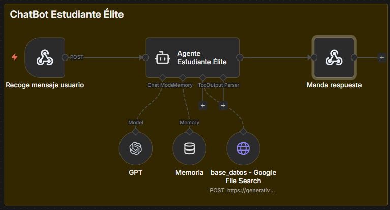
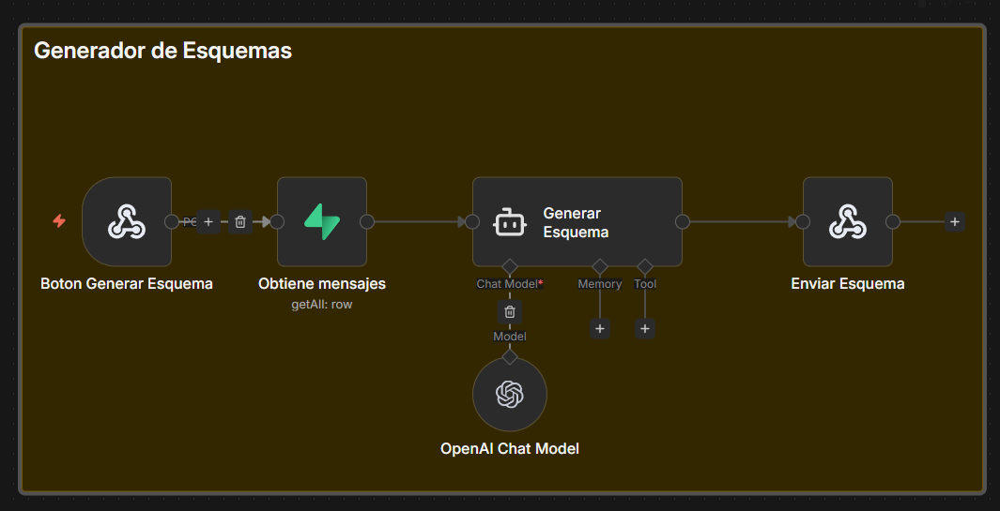

# Estudiante Elite 🛡️⚖️

**El tutor pedagógico de IA definitivo para estudiantes de Derecho.**


## 🎓 Descripción

**Estudiante Elite** es una plataforma educativa premium diseñada específicamente para la comunidad jurídica. Combina algoritmos avanzados de IA con una interfaz de usuario sofisticada para ofrecer tutorías personalizadas, generación de esquemas complejos y gestión eficiente del historial de estudio.

## ✨ Características Principales

- 🎨 **Interfaz Premium de Nueva Generación**: Diseño fluido con efectos de glassmorphism, micro-animaciones nativas en CSS y una experiencia visual de alto nivel.
- 💬 **Tutoría Inteligente via n8n**: Conexión en tiempo real con flujos de trabajo de n8n para proporcionar respuestas precisas y pedagógicas.
- 📊 **Generador de Esquemas Jurídicos**: Herramienta integrada para transformar conceptos complejos en estructuras visuales claras.
- 🔐 **Seguridad y Persistencia**: Sistema de autenticación con Supabase y almacenamiento en tiempo real de conversaciones.
- 🚀 **Optimización Extrema**: Sin dependencias pesadas de animación, utilizando CSS puro para un rendimiento impecable.

## 🤖 Arquitectura n8n

El núcleo de la inteligencia de Estudiante Elite reside en flujos de trabajo automatizados que gestionan la lógica pedagógica:

### 1. Tutor Pedagógico Principal
Este flujo gestiona la conversación interactiva, manteniendo el contexto del usuario y aplicando técnicas de enseñanza adaptativas.



### 2. Generador de Esquemas y Resúmenes
Especializado en el análisis de textos legales, este flujo estructura la información para facilitar la memorización y el repaso.



## 🛠️ Stack Tecnológico

- **Frontend**: Vite + React 19 + TypeScript
- **Estilos**: Vanilla CSS con arquitectura de variables personalizadas
- **Backend as a Service**: Supabase (Auth, PostgreSQL, RLS)
- **Capa de IA / Automatización**: n8n Webhooks & Workflows
- **Iconografía**: Lucide React
- **Despliegue**: Netlify (CI/CD)

## 🎨 Sistema de Diseño

### Paleta de Colores Exclusiva
- **Fondo**: `#121827` (Dark Slate Profundo)
- **Principal**: `#1E3A8A` (Azul Real Académico)
- **Acento**: `#00C2FF` (Cian Eléctrico)
- **Resalte**: `#E1C699` (Oro Suave/Cápsula de Tiempo)
- **Superficies**: Glassmorphism con un 80% de desenfoque.

## 🚀 Instalación y Desarrollo

```bash
# 1. Instalar dependencias
npm install

# 2. Configurar variables de entorno (.env)
VITE_SUPABASE_URL=tu_url
VITE_SUPABASE_ANON_KEY=tu_key
VITE_N8N_WEBHOOK_URL=tu_webhook_url

# 3. Lanzar entorno de desarrollo
npm run dev
```

---
Desarrollado con ❤️ para los futuros pilares de la justicia.
⚖️ **Justicia, Rigor y Tecnología.**
