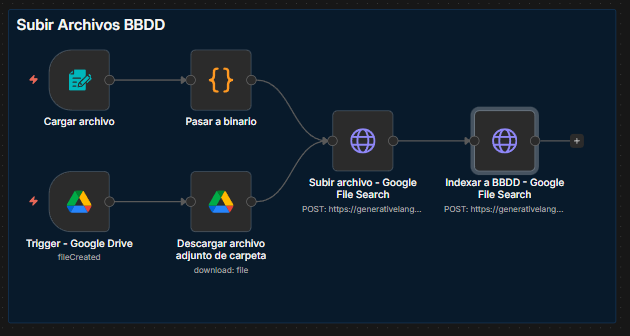
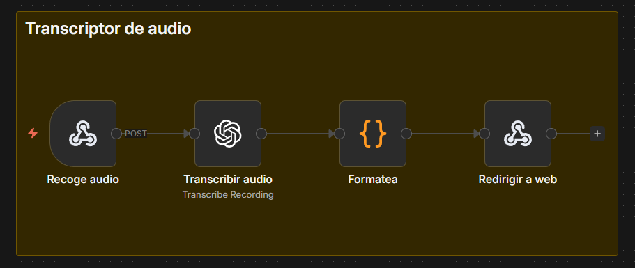
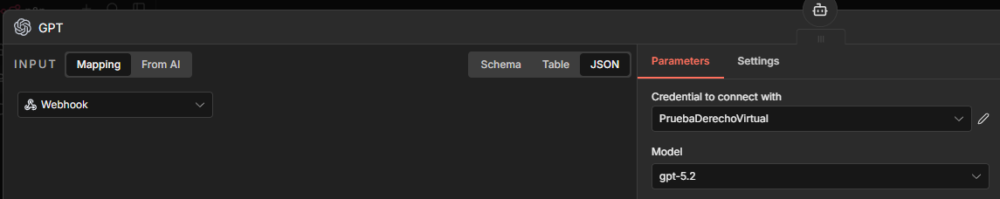
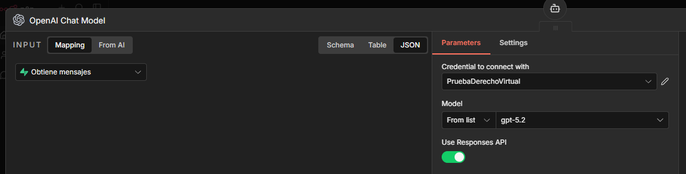

# Estudiante Elite 🛡️⚖️

**El tutor pedagógico de IA definitivo para estudiantes de Derecho.**

### [🚀 **VER DEMO DESPLEGADA AQUÍ**](https://estudiante-elite.netlify.app/)

---

### 🎓 Descripción

**Estudiante Elite** es una plataforma educativa premium diseñada específicamente para la comunidad jurídica. Combina algoritmos avanzados de IA con una interfaz de usuario sofisticada para ofrecer tutorías personalizadas, generación de esquemas complejos y gestión eficiente del historial de estudio.

El sistema no se limita a responder dudas, sino que actúa como un tutor proactivo que fomenta el estudio activo.

### ✨ Características Principales

- 💬 **Tutoría Inteligente via n8n**: Conexión en tiempo real con flujos de trabajo de n8n para proporcionar respuestas precisas y pedagógicas.

- 🎤 **Transcripción de Audio con OpenAI Whisper**: Sistema de transcripción de voz que funciona en **todos los navegadores** (Chrome, Firefox, Safari, Edge, Opera, Brave) con alta precisión en terminología legal.

- 📊 **Generador de Esquemas Jurídicos**: Herramienta integrada para transformar conceptos complejos en estructuras visuales claras.

- 🔐 **Seguridad y Persistencia**: Sistema de autenticación con Supabase y almacenamiento en tiempo real de conversaciones e historial.

- 🚀 **Optimización Extrema**: Sin dependencias pesadas de animación, utilizando CSS puro para un rendimiento impecable.

---

### 🤖 Arquitectura n8n y Lógica Pedagógica

El núcleo de la inteligencia de Estudiante Elite reside en flujos de trabajo automatizados que gestionan la lógica pedagógica:

#### 1. Tutor Pedagógico Principal

Este flujo gestiona la conversación interactiva, manteniendo el contexto del usuario (memoria de sesión) y aplicando técnicas de enseñanza adaptativas como el método Feynman o preguntas de autoevaluación.


_Fig 1. Workflow principal del chatbot con memoria y RAG_

#### 2. RAG con Manuales Oficiales

Implementación de **RAG (Generación Aumentada por Recuperación)** utilizando los **manuales oficiales de la carrera**. El sistema consulta la base de conocimientos oficial antes de generar respuestas para asegurar precisión jurídica y alineación con el temario.


_Fig 2. Workflow para indexar documentos en la base de conocimientos_

#### 3. Transcripción de Audio

Sistema de transcripción utilizando **OpenAI Whisper API** que permite a los estudiantes hacer preguntas hablando. El audio se procesa en tiempo real y se convierte a texto con alta precisión en español legal.


_Fig 3. Workflow de n8n para transcripción de audio con OpenAI Whisper_

---

### ⚙️ Configuración del Modelo y API (Compliance)

_Documentación técnica del entregable obligatorio._

Para garantizar la **velocidad de respuesta y baja latencia** requerida en las especificaciones técnicas de la prueba, el sistema utiliza el modelo **ChatGPT 5.2** orquestado a través de n8n.

A continuación se adjunta la evidencia de la configuración en los nodos de producción, asegurando el cumplimiento de la optimización del modelo:


_Fig 4. Configuración del nodo principal con modelo gpt-5.2_


_Fig 5. Validación del modelo en el flujo de chat OpenAI_

---

### 🛠️ Stack Tecnológico

- **Frontend**: Vite + React 19 + TypeScript
- **Estilos**: Vanilla CSS con arquitectura de variables personalizadas
- **Backend as a Service**: Supabase (Auth, PostgreSQL, RLS)
- **Capa de IA / Automatización**: n8n Webhooks & Workflows
- **Transcripción de Audio**: OpenAI Whisper API (vía n8n)
- **Iconografía**: Lucide React
- **Despliegue**: Netlify (CI/CD)

### 🎨 Sistema de Diseño

#### Paleta de Colores Exclusiva

- **Fondo**: `#121827` (Dark Slate Profundo)
- **Principal**: `#1E3A8A` (Azul Real Académico)
- **Acento**: `#00C2FF` (Cian Eléctrico)
- **Resalte**: `#E1C699` (Oro Suave/Cápsula de Tiempo)
- **Superficies**: Glassmorphism con un 80% de desenfoque.

#### Componentes de UI

- **Botones Circulares de Acción**: Diseño consistente para esquemas y micrófono
- **Indicadores de Estado**: Animaciones de pulso para grabación activa
- **Feedback Visual**: Mensajes de progreso durante procesamiento de IA

---

### 🚀 Instalación y Desarrollo local

1. Clonar el repositorio

```bash
git clone https://github.com/tu-usuario/estudiante-elite.git
```

2. Instalar dependencias

```bash
npm install
```

3. Configurar variables de entorno (.env)

```bash
VITE_SUPABASE_URL=tu_url
VITE_SUPABASE_ANON_KEY=tu_key
VITE_N8N_WEBHOOK_URL=tu_webhook
VITE_N8N_SUMMARY_WEBHOOK_URL=tu_webhook_summary
VITE_N8N_TRANSCRIBE_WEBHOOK_URL=tu_webhook_transcribe
```

4. Ejecutar servidor de desarrollo

```bash
npm run dev
```

---

### 📝 Notas Técnicas

#### Sistema de Transcripción

La funcionalidad de transcripción de audio utiliza **OpenAI Whisper API** a través de n8n con la siguiente arquitectura:

**Frontend (MediaRecorder API):**

```typescript
// Grabación de audio cross-browser
const recorder = new AudioRecorder();
await recorder.startRecording(); // Inicia grabación
const audioBlob = await recorder.stopRecording(); // Obtiene audio
```

**Backend (n8n + OpenAI Whisper):**

- Webhook recibe audio en formato WebM/Opus
- OpenAI Whisper transcribe con modelo `whisper-1`
- Configurado para español (`es`) con alta precisión en terminología legal
- Respuesta JSON con texto transcrito

**Ventajas técnicas:**

- ✅ Compatible con todos los navegadores modernos (MediaRecorder API)
- ✅ Procesamiento en la nube (no consume recursos del cliente)
- ✅ Optimizado para español

#### Requisitos del Sistema

- **HTTPS**: Requerido para acceso al micrófono (funciona en `localhost` para desarrollo)
- **Permisos de Micrófono**: El navegador solicitará permiso la primera vez
- **Conexión a Internet**: Necesaria para enviar audio a n8n/OpenAI
- **n8n Webhook**: Debe estar configurado y activo
